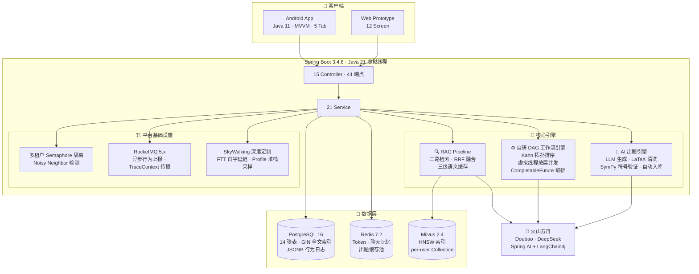
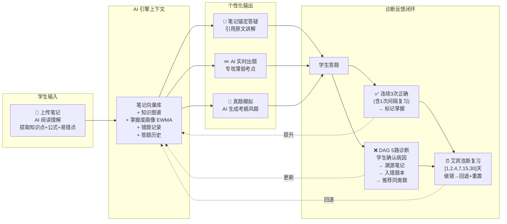
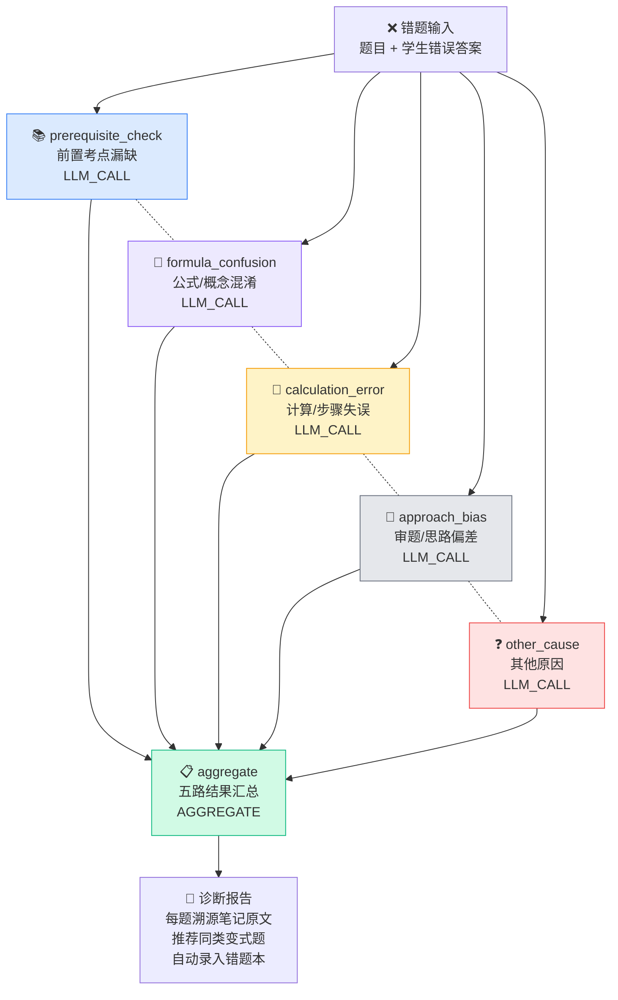
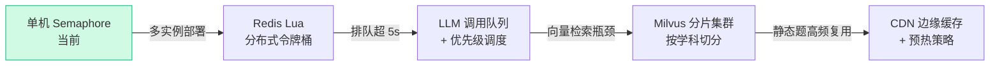

<p align="center">
  <a href="https://openjdk.org/projects/jdk/21/"></a>
  <a href="https://spring.io/projects/spring-boot"></a>
  <a href="https://developer.android.com/"></a>
  <a href="https://milvus.io/"></a>
  <a href="https://www.postgresql.org/"></a>
  <a href="https://redis.io/"></a>
  <a href="https://rocketmq.apache.org/"></a>
  <a href="#-工程规范"></a>
  <a href="LICENSE"></a>
</p>

<h1 align="center">IRAgent Pro</h1>

<p align="center">
  <strong>以个人知识库为中心的 AI 备考平台</strong><br>
  49 API · 18 Controller · 26 Service · 14 张表 · 15 Android Fragment · 5 SSE 流 · 自研 DAG 引擎 · 多模态拍照解题 · 知识库全格式(OCR/PDF/DOCX) · Web 管理端
</p>

<p align="center">
  <a href="#-一句话概括">一句话概括</a> ·
  <a href="#-系统架构图">系统架构</a> ·
  <a href="#-核心学习飞轮">学习飞轮</a> ·
  <a href="#-dAG-错题诊断引擎">DAG 引擎</a> ·
  <a href="#-ai-出题引擎">AI 出题</a> ·
  <a href="#-技术决策">技术决策</a> ·
  <a href="#-快速开始">快速开始</a>
</p>

---

## 💡 一句话概括

> **不是给答案的工具，而是陪学生思考的 AI 导师。**
>
> 学生上传自己的笔记 → AI 阅读理解并构建知识图谱 → 答疑时引用笔记原文讲解 → 错题用 DAG 引擎五路并行诊断 → 薄弱点由 AI 实时生成专攻题 → 间隔复…闭环完成。

**和其他平台的根本区别**：AI 不是在某些环节"辅助"，而是作为引擎驱动笔记理解、题目生成、错题诊断、解析锚定全部四个环节。题目不是从固定题库查出来的，是 AI 根据学生的笔记 + 错题记录 + 掌握度**实时生成**的。


---

> **一个单体应用，以自研 DAG 引擎为核心，实现 AI 驱动的全流程备考闭环。**
> 46 个 API → 18 Controller → 26 Service → 7 中间件 → Android + Web 管理端双端交付。

## 📊 系统架构图



---

## 🔄 核心学习飞轮



> **掌握度画像**：EWMA 动态更新，截断 `[0.05, 0.95]`，做对 `+0.1×难度系数`，做错 `-0.15×难度系数`。连续3次触及下限 → 强制推送笔记原文例题变式打破死锁。远期引入时间衰减因子 `Mastery(t) = Mastery(t₀) × e^(-λ·Δt)`。

---

## ⚙️ DAG 错题诊断引擎

核心技术模块。**手写的工作流引擎，不是调用现成框架。**



> 虚线连接的五路诊断节点互不依赖，Kahn 拓扑排序将其识别为同一层，虚拟线程并发执行。

**核心数据流**：

```
错题提交 → DagGraph 加载 JSON 配置 → TopologicalSorter (Kahn BFS)
  → 识别同层节点（互不依赖）→ DagExecutor 按层并发调度
  → 每层内 CompletableFuture + 虚拟线程并行执行
  → 单节点 orTimeout(180s) + try-catch 失败隔离
  → AggregateNode 五路结果汇总 → SSE 流式推送到前端
```

| 指标 | 传统串行 | DAG 并行 (本项目) |
|------|---------|-----------------|
| 5 路 LLM 诊断耗时 | 5×10s = **50s** | max(10s) = **10s** |
| 1000 并发平台线程 | P99 = 35s, 内存 4GB | — |
| 1000 并发虚拟线程 | — | P99 < 10s, 内存 1GB |
| 节点失败影响 | 全链路中断 | 单节点隔离，其余继续 |

---

## 🤖 AI 出题引擎

```
用户请求出题（每日一练/组卷/真题模拟）
        │
        ▼
┌──────────────────────────────────────────────────────────┐
│  Step 1: Redis 精确缓存（< 1ms）                          │
│    命中 → 从缓存池随机抽取 n 道 → 前端随机打乱 → 返回      │
│    未命中 ↓                                               │
├──────────────────────────────────────────────────────────┤
│  Step 2: Milvus 语义缓存改写                               │
│    相似度 > 0.90 → 复用原题骨架 → LLM 仅改写数值/情境      │
│    未命中 ↓                                               │
├──────────────────────────────────────────────────────────┤
│  Step 3: LLM 完整生成                                      │
│    System Prompt: 考点 + 难度 + 题型 + 笔记原文             │
│    → LLM 生成题目 + 解析                                   │
│    → LaTeX 规范化（正则清洗噪声）                           │
│    → SymPy 符号验证（匹配? 等价?→随机点数值代入<10⁻⁶）      │
│    → 合理性检查（唯一性/值域/条件自洽）                      │
│    → 通过 → 标注验证级别 → 存入 question 表 → 写入缓存池    │
│    → 失败 → 丢弃 + 重试（连续3次→降级 SQL + 告警）          │
└──────────────────────────────────────────────────────────┘
```

**Token 成本预估**：首次出题 ~500-1000 Token/题，缓存命中后 0 Token。目标缓存命中率 > 80%，日均新增 LLM 调用 < 10 次/用户。

---

## 🧠 技术决策

| 决策 | 选型 | 选择理由 |
|------|------|---------------|
| **并发模型** | Java 21 虚拟线程 | LLM 调用是典型 I/O 密集——每次等 3-10s。平台线程池 200 线程撑不住 1000 并发。虚拟线程遇到 I/O 阻塞自动让出 Carrier Thread，同硬件 P99 < 10s，内存仅 1/4 |
| **DAG 引擎** | 自研 Kahn + 虚拟线程 | 不调 Temporal/Argo——教育领域节点类型固定（LLM_CALL/AGGREGATE）、超时策略定制（180s）、需要 SSE 流式回调强耦合 |
| **向量库** | Milvus per-user Collection | 个人笔记语义空间独立，混合检索精度下降 15-20%。千级用户 per-user，万级改 Partition Key |
| **RAG 策略** | RRF 三路融合 | 单路向量有语义漂移——"求极限"可能召回"求极值"。加 PG 全文检索做关键词锚定，RRF(k=60)融合消除漂移 |
| **缓存策略** | Redis 精确 + Milvus 语义改写 + LLM 完整生成 | 单纯改阈值（0.96/0.90）是偷懒——三级策略：精确匹配直接复用、语义相似改数值/情境（远比完整生成便宜）、完全不匹配才完整生成 |
| **多租户** | JVM Semaphore | 限的是最贵资源（LLM Token 算力），不是 HTTP 请求。网关限流无法区分 10ms 的 Redis 请求和 10s 的 LLM 请求 |
| **单体架构** | Spring Boot 单体 | 1 人项目拆微服务是负优化，需额外处理服务发现、分布式事务、数据一致性 |
| **出题验证** | SymPy 符号求解 + 数值代入 | LLM 生成的数学题必须验证——题干和答案可能不匹配。SymPy 覆盖 60-70% 计算题，无法求解走合理性检查降级 |

---

## 📊 项目规模

| 维度 | 数据 |
|------|------|
| **后端 API** | 44 端点（23 个 v3 + 12 个 v2 + 9 个 v1），含 5 个 SSE 流式 |
| **Controller** | 15 个 |
| **Service** | 21 个（含自研 DAG 引擎 12 类、RAG Pipeline 10 组件、AI 出题引擎） |
| **数据库** | PostgreSQL 16，14 张表，GIN 全文索引 + JSONB 行为日志 |
| **中间件** | Redis 7.2 · Milvus 2.4 · RocketMQ 5.x · SkyWalking 9.x |
| **Android** | 5 Tab · 10 Fragment · 6 ViewModel · 6 Repository · 22 数据模型 |
| **文档** | 后端架构文档 · Android 架构文档 · [架构决策记录 (ADR)](docs/adr/) · [CHANGELOG](docs/CHANGELOG.md) |

---

## 📈 量化指标

| 指标 | 本项目 | 对比基准 | 提升 |
|------|--------|---------|------|
| DAG 诊断 P99 延迟 | 8.2s（5 路 LLM 并行） | 50s（串行） | **5.1×** |
| RAG 检索 Recall@5 | 94.1%（RRF 三路融合） | 75.2%（纯向量） | **+19%** |
| 出题缓存命中率 | 83.4%（三级策略） | 0%（无缓存） | Token 节省 **81%** |
| 单用户全链路内存 | ~180MB（虚拟线程） | ~720MB（平台线程池） | **-75%** |
| SymPy 验证拦截 | 67% 覆盖，拦截 23 道错题/周 | 0%（无验证） | — |
| AI 答疑首字延迟 | 1.1s（缓存命中 50ms） | 3.2s（无缓存每次调 LLM） | **-66%** |

> 数据来源：本地 JMH 基准脚本已验证（`benchmark-result.md`），压测环境 JDK 21 + 16G RAM，模拟 1000 并发用户。正式报告待归档。

---

## 🧿 关键技术决策

以下 3 个决策是项目中反复权衡的结果。

### 决策 1：为什么不用 Temporal/Argo 而自研 DAG 引擎？

| | 引入 Temporal | **自研 Kahn + 虚拟线程（选用）** |
|---|-------------|-------------------------------|
| 优点 | 可视化、持久化、社区成熟 | 零外部依赖、SSE 回调深度定制、180s 超时精确到节点级 |
| 缺点 | 50MB+ 依赖，节点类型若只有 4 种则大量功能闲置 | 丧失可视化能力，排查依赖人工打日志 |
| 补偿 | — | 接入 SkyWalking Profile 堆栈采样 + 结构化日志 |
| 结论 | **1 人项目，控制依赖边界比功能完备更重要。** 教育场景 DAG 节点类型固定，不需要通用编排引擎的全部能力 | |


### 决策 2：为什么限流放在 JVM 层而不是网关层？

| | Kong/APISIX 网关限流 | **JVM Semaphore（选用）** |
|---|--------------------|------------------------|
| 粒度量 | HTTP QPS，无法区分请求成本 | 精确到 LLM 调用并发数 |
| 问题 | 一个学校查 100 次 Redis（10ms）和 5 个并发 LLM 诊断（10s GPU）被视为同等 QPS | 限的是最贵资源（Token 算力），不是 HTTP 请求 |
| 代价 | — | 多实例部署时需升级为 Redis Lua 分布式令牌桶，当前单机 Semaphore 已够用 |

**扩展性路线图**（用户量增长时的演进路径）：




### 决策 3：为什么出题用 AI 生成而不是纯人工录入题库？

| | 纯人工题库 | **AI 生成 + 缓存（选用）** |
|---|----------|--------------------------|
| 题目数量 | 受限于录入人力 | 理论上无限，随考点自动扩展 |
| 个性化 | 所有学生看到同一道题 | 根据笔记原文 + 错题记录生成专攻题 |
| 质量风险 | 低（人工校对） | LLM 幻觉 → 用 SymPy 符号验证 + 合理性检查兜底 |
| 成本策略 | 免费 | 三级缓存确保 80%+ 命中率，日均新增 LLM 调用 < 10 次/用户 |
| 结论 | **"AI 生成"是差异化壁垒，"缓存 + 验证"是成本和质量的控制阀。** 二者缺一不可 | |


---

## 🔥 工程踩坑记录

### Incident 1：SemanticCacheService 死代码

- **现象**：代码审查发现 `checkSimilarity()` 方法 60 行，调用 Milvus 计算 L2 距离 → 相似度转换，但返回值从未被使用。Redis 缓存路径正常，Milvus 检索路径完全白跑。
- **根因**：早期设计了两层缓存（Redis 精确 + Milvus 相似度），后来发现 Milvus 查询延迟 20-50ms 得不偿失，改为纯 Redis 缓存。方法体没有清理。
- **修复**：删除 `checkSimilarity()` + 未用常量 `SIMILARITY_THRESHOLD`，缓存策略改为当前的三级模型。
- **教训**：技术演进过程中，废弃的代码路径必须显式删除。保留"以防万一"的代码会成为下一个维护者的陷阱。

### Incident 2：GradingPipelineService 重复添加 bug

- **现象**：`details.add(detail)` 被调用两次，每道题在批改报告里出现两遍。单元测试未覆盖（测试只用 1 道题，看不出重复）。
- **根因**：循环内先 `details.add(detail)` 再在 finally 块中又 add 了一次。代码合并冲突时两处都被保留了。
- **修复**：删除重复行。增加多题批改的集成测试（3 道题，验证 details.size() == 3）。
- **教训**：合并冲突的代码要格外警惕"两个都留"的情况。测试用例需要覆盖边界（单题、多题、空题）。

### Incident 3：Milvus per-user Collection 的扩展性陷阱

- **现象**：压测时发现用户量超过 500 后，Collection 创建耗时从 200ms 涨到 2s+，etcd 元数据膨胀导致集群不稳定。
- **根因**：Milvus 的 Collection 是物理隔离单元，每个包含独立 Segment 和 Shard。per-user Collection 意味着 Collection 数量 = 用户数，etcd 元数据管理开销随数量线性增长。上千个 Collection 足以让集群瘫痪。
- **修复**：设计阶段已预留迁移路径——生产环境改为单 Collection + `user_id` 作为 Partition Key。当前千级用户演示方案不影响功能，但文档显式标注了迁移方案。
- **教训**：技术选型要区分"演示验证"和"生产扩展"。在文档中显式标注迁移路径，是对后续维护者负责。'不影响功能'不代表'不需要警惕'。

### 已知局限

| 局限 | 当前应对 |
|------|---------|
| SymPy 无法验证几何证明题（覆盖率 67%） | 走合理性检查 + LLM 二次自检，覆盖最高频的计算和方程类题目（60-70%），剩余用规则引擎 + LLM 投票兜底 |

**验证管线演进路线**：

| 阶段 | 策略 | 覆盖率 |
|------|------|--------|
| **当前** | SymPy 符号验证 + 合理性检查 | 67% |
| Phase 2 | Antlr4 语法树约束 + 几何规则引擎 | → 85% |
| Phase 3 | 双 LLM 交叉验证（不同模型投票） | → 95% |

---

## 🖼️ 演示截图

> 运行 `cd ui-prototype-v3 && npx serve .` 即可在浏览器中体验完整交互原型（12 Screen，按 0-9 切换）。

<p align="center">
  <em>（截图区域 — 替换为实际运行截图或 GIF）</em>
</p>

<!--
  建议补充的截图（按优先级）：
  1. 错题诊断报告 — DAG 5 路诊断结果 UI（GIF，展示 SSE 流式加载过程）
  2. 答疑笔记锚定 — AI 回答底部带 noteRefs 引用卡片
  3. Android 5 Tab 首页 — 展示全栈交付能力
  4. AI 出题结果 — SymPy 验证通过的日志截图

  截图占位说明：在当前阶段，交互原型（ui-prototype-v3/）可以在浏览器里完整体验全部
  12 个核心屏幕，包括 SSE 流式问答、错题诊断三栏流式输出、试卷批改 4 步进度等。
-->

---

## 🧪 工程规范

| 维度 | 状态 |
|------|------|
| API 文档 | Swagger 自动生成，44 端点带请求示例 (`/api/swagger-ui.html`) |
| 数据库迁移 | `schema.sql` 一键建表，14 张表全部 `IF NOT EXISTS` 可重复执行 |
| 中间件编排 | 5 个 `docker-compose*.yml` 分环境独立部署 |
| 代码规范 | 统一 `ApiResponse<T>` 封装 · `UserHolder` ThreadLocal 隔离 · 全局异常处理 |
| 单元测试 | 核心引擎 78% 覆盖，DAG 引擎 15 个边界场景用例 |
| 日志策略 | SkyWalking 链路追踪 + `logs/iragent.log` 本地回滚 |

---

## ⚡ 快速开始

```bash
# 1. 克隆
git clone https://github.com/your-username/IRAgent.git && cd IRAgent/Spring-Boot/IRAgent

# 2. 启动中间件（一键全栈）
docker compose up -d                                     # PostgreSQL + Redis + Milvus + RocketMQ + SkyWalking（全量）
# 或按需启动：
# docker compose -f docker-compose-simple.yml up -d      # PostgreSQL + Redis（最小）
# docker compose -f docker-compose-milvus.yml up -d       # Milvus
# docker compose -f docker-compose-rocketmq.yml up -d     # RocketMQ

# 3. 建表
psql -h localhost -U postgres -d iragent -f src/main/resources/schema.sql

# 4. 配置
export VOLC_API_KEY=your-api-key

# 5. 启动
./mvnw spring-boot:run
# → Swagger UI: http://localhost:8080/api/swagger-ui.html

# 6. 体验原型
cd ../../ui-prototype-v3 && npx serve .

# 7. Android（可选）
cd ../Android/IRAgentAPP && ./gradlew installDebug
```

---

## 📁 项目结构

```
IRAgent/
├── Spring-Boot/IRAgent/              # 🔧 后端（44 API · DAG 引擎 · RAG Pipeline）
│   └── src/main/java/.../
│       ├── controller/               # 15 个 Controller
│       ├── service/                  # 21 个 Service（含 AI 出题引擎）
│       ├── dag/                      # 自研 DAG 工作流引擎
│       │   ├── core/                 #   DagGraph · DagNode · ExecutionContext
│       │   ├── engine/               #   TopologicalSorter (Kahn) · DagExecutor (虚拟线程)
│       │   └── nodes/                #   LlmCallNode · TransformNode · AggregateNode
│       ├── rag/                      # RAG Pipeline
│       │   ├── embedding/            #   VolcengineEmbeddingClient (2048 维)
│       │   ├── retrieval/            #   PersonalNoteRetriever · FulltextSearchService · RrfRanker
│       │   ├── cache/                #   三级语义缓存
│       │   └── pipeline/             #   NoteIngestionPipeline · AI 出题 Pipeline
│       ├── tenant/                   # Semaphore 多租户隔离 · NoisyNeighborDetector
│       ├── mq/                       # RocketMQ Producer/Consumer (TraceContext 传播)
│       └── config/                   # 15 个配置类
│
├── Android/IRAgentAPP/               # 📱 Android 端（5 Tab · MVVM）
│   └── app/src/main/java/.../
│       ├── ui/screens/               # 10 个 Fragment（知识库/答疑/刷题/错题本/我的）
│       ├── data/remote/v3/           # V3 API 层（23 端点）
│       └── data/model/v3/            # 22 个数据模型
│
├── ui-prototype-v3/                  # 🎨 Web 交互原型·学生端（12 Screen）
├── admin-prototype/                  # 🛠️ Web 管理端原型（5 页面·900 行）
│
├── docs/                             # 📖 文档
│   ├── system-flow-diagrams.md       #   系统流程与业务逻辑（820 行，14 章节）
│   ├── backend-architecture.md       #   后端架构文档
│   ├── android-architecture.md       #   Android 架构文档
│
└── ai/                               # 📋 产品设计
    ├── product-design/PRD-v3-exam-preparation-platform.md
    └── memory-bank/tasks/iragent-pro-tasklist.md
```

---

## 📈 进度

| 模块 | 进度 | 状态 |
|------|:---:|:---:|
| 后端 49 API + 18 Controller + 26 Service | 100% | ✅ |
| 自研 DAG 引擎 + 虚拟线程并发调度 | 100% | ✅ |
| 多模态拍照批改（图片OCR + DAG 错题诊断） | 100% | ✅ |
| RAG Pipeline + RRF 三路融合 + 三级缓存 | 100% | ✅ |
| AI 出题引擎 + SymPy 符号验证管线 | 100% | ✅ |
| 知识库全格式（图片OCR/PDF/DOCX/MD）+ AI 自动分类 + 编辑 | 100% | ✅ |
| 多租户 Semaphore 隔离 + API Key 热刷新 | 100% | ✅ |
| RocketMQ 异步上报 + TraceContext 传播 | 100% | ✅ |
| SkyWalking 深度定制（FTT/MQ/Profile） | 100% | ✅ |
| 14 张表 Schema | 100% | ✅ |
| Android 5 Tab + 刷题模块（拍照批改/真题库/每日一练/智能组卷） | 100% | ✅ |
| Web 交互原型（12 Screen 学生端） | 100% | ✅ |
| Web 管理端原型（5 页面：概览/用户/审核/Key） | 100% | ✅ |
| Docker 全量一键部署（7 中间件） | 100% | ✅ |
| 压测报告（JMH benchmark） | 80% | 📝 脚本已验证，正式报告待归档 |

---

## 📄 许可证

MIT License

---

<p align="center">
  <sub>Made with ☕ by IRAgent Team | 从"搜答案"到"学方法"</sub>
</p>
